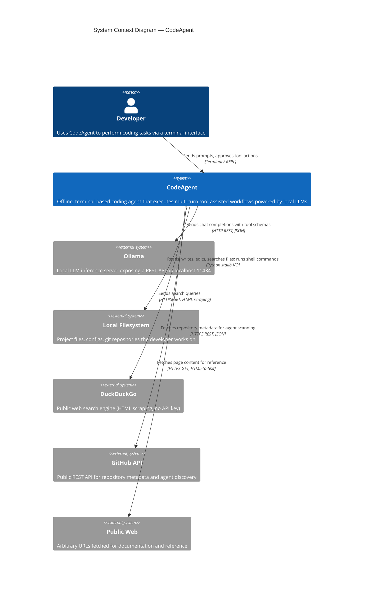

# C1 - System Context Diagram

Shows CodeAgent as a black box and its relationships with users and external systems.

## Data Flow Summary

| Flow | Protocol | Latency | Auth Required |
|------|----------|---------|---------------|
| Developer &rarr; CodeAgent | stdin (terminal) | Instant | None |
| CodeAgent &rarr; Ollama | HTTP REST (localhost) | 1-60s per turn (model-dependent) | None |
| CodeAgent &rarr; Filesystem | Python `pathlib` / `subprocess` | <100ms typical | OS-level permissions |
| CodeAgent &rarr; DuckDuckGo | HTTPS GET | 1-3s | None (HTML scraping) |
| CodeAgent &rarr; GitHub API | HTTPS GET | 1-3s | None (public endpoints, rate-limited) |
| CodeAgent &rarr; Public Web | HTTPS GET | 1-5s | None |

## Key Constraints

- **Fully offline capable**: Ollama and filesystem are the only required
  dependencies. Web features can be disabled with `--no-web`.
- **No API keys anywhere**: All external integrations use public, unauthenticated
  endpoints or local services.
- **Single-user system**: One developer interacts with one CodeAgent instance at
  a time. No multi-tenancy or shared state.
