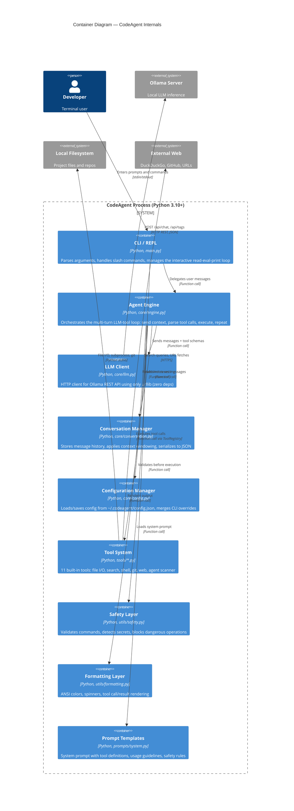

# C2 - Container Diagram

Zooms into CodeAgent to show the major runtime units and their interactions.

## Container Responsibilities

| Container | Responsibility | Key Files |
|-----------|---------------|-----------|
| **CLI / REPL** | User-facing interface, argument parsing, command dispatch | `agent/main.py` |
| **Agent Engine** | Core loop: LLM call &rarr; parse &rarr; execute &rarr; loop | `agent/core/engine.py` |
| **LLM Client** | Zero-dependency HTTP wrapper for Ollama REST API | `agent/core/llm.py` |
| **Conversation Manager** | Message history with context windowing (200 msg / 100K char limits) | `agent/core/conversation.py` |
| **Configuration Manager** | Layered config: defaults &rarr; file &rarr; CLI overrides | `agent/core/config.py` |
| **Tool System** | 11 tools with registry, JSON schema generation, standardized results | `agent/tools/*.py` |
| **Safety Layer** | Command blocking, secret detection, path validation | `agent/utils/safety.py` |
| **Formatting Layer** | Cross-platform ANSI output with color detection and fallbacks | `agent/utils/formatting.py` |
| **Prompt Templates** | System prompt construction with dynamic tool definitions | `agent/prompts/system.py` |

## Latency Profile

```mermaid
gantt
    title Typical Single-Turn Latency Breakdown
    dateFormat X
    axisFormat %s s

    section User Input
    Parse + dispatch           :0, 50

    section LLM Inference
    Ollama /api/chat (7B model) :50, 15000

    section Tool Execution
    Read file                  :15050, 100
    Safety validation          :15050, 20
    Grep search                :15070, 500

    section Response
    Format + render            :15570, 30
```

> **Dominant latency**: LLM inference (1-60s depending on model size, GPU, and
> prompt length). All other operations are sub-second on local hardware.
