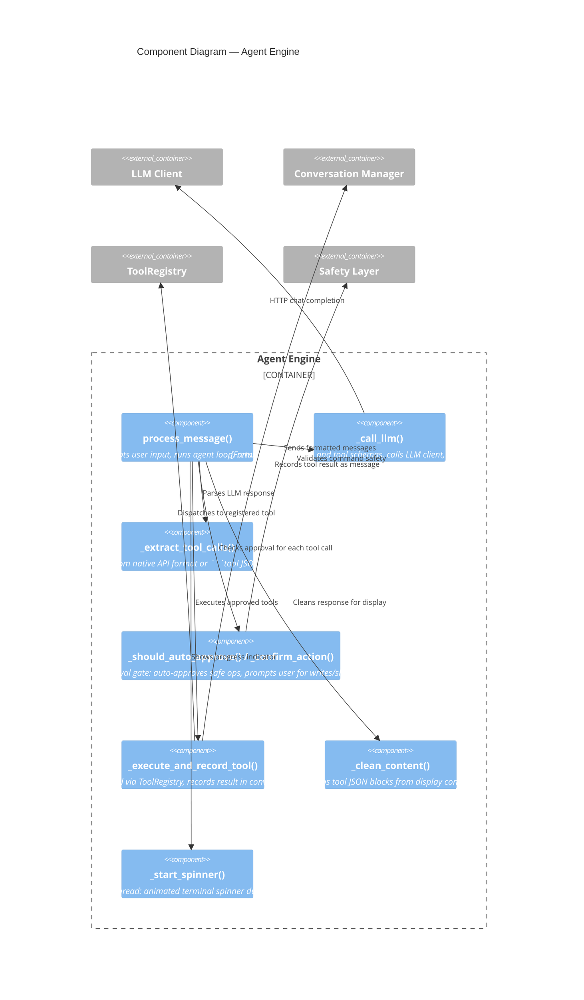
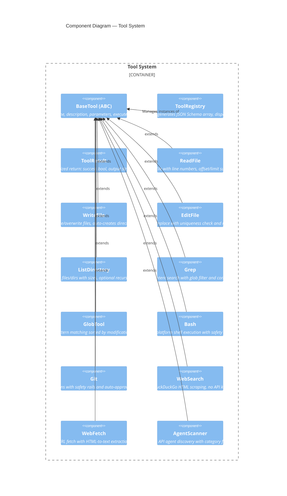
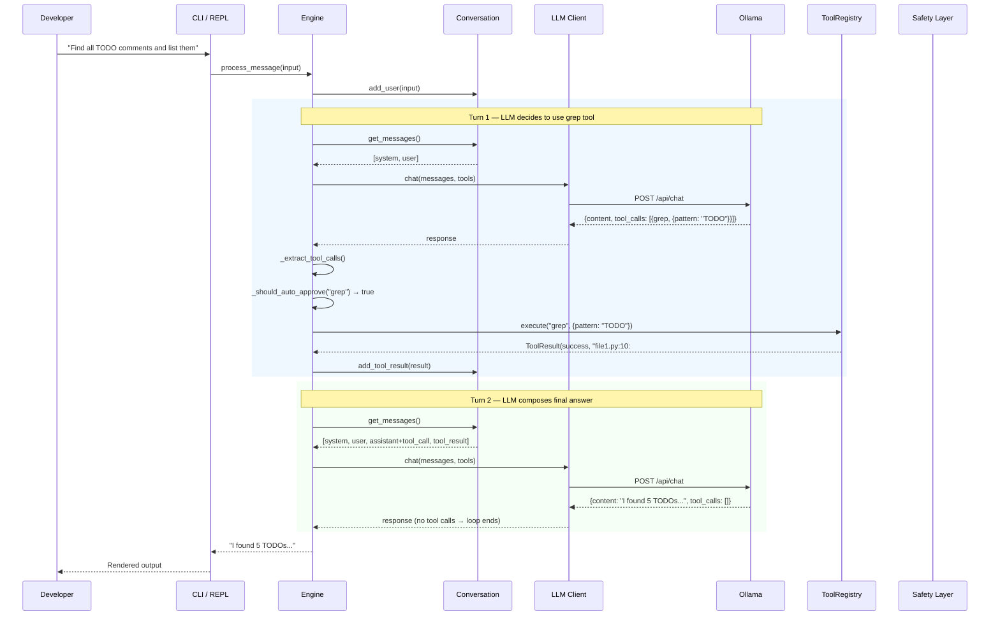
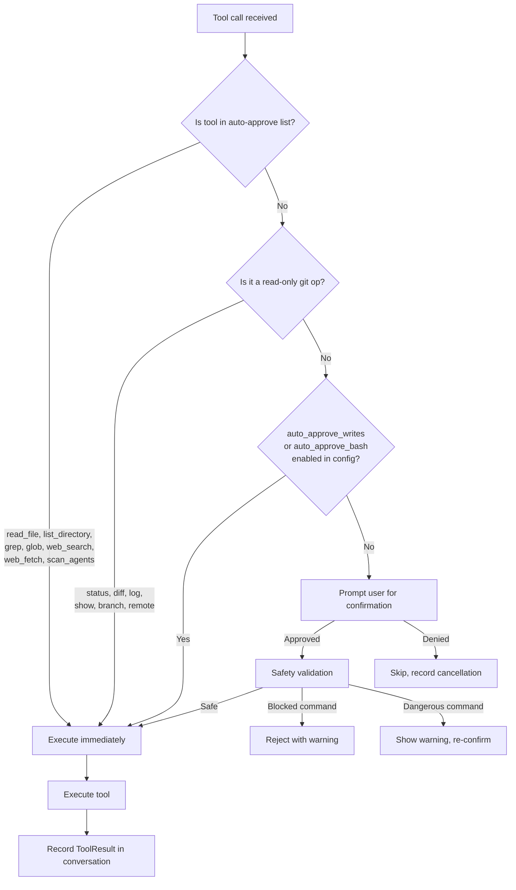

# C3 - Component Diagram

Zooms into the Agent Engine and Tool System to show individual components and
their interactions.

## Agent Engine Components

## Tool System Components

## Data Flow: Multi-Turn Agent Loop

## Approval Flow Detail

