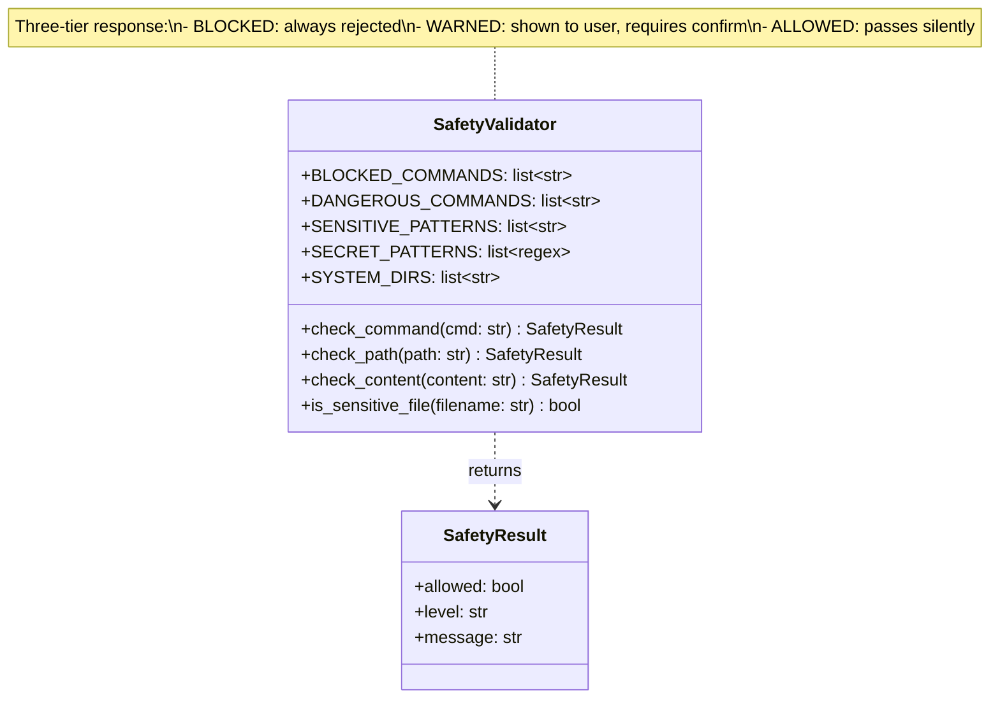

# C4 - Code Level Diagram

Class-level design of the core subsystems. These diagrams map directly to source
files and can be used for onboarding and code review.

## Tool System Class Hierarchy

```mermaid
classDiagram
    class BaseTool {
        <<abstract>>
        +name: str*
        +description: str*
        +parameters: dict*
        +working_directory: str
        +execute(**kwargs) ToolResult*
        +to_ollama_tool() dict
        +_resolve_path(path) Path
    }

    class ToolResult {
        +success: bool
        +output: str
        +error: str
    }

    class ToolRegistry {
        -_tools: dict~str, BaseTool~
        +register(tool: BaseTool)
        +get(name: str) BaseTool
        +execute(name, **kwargs) ToolResult
        +get_tool_definitions() list~dict~
        +update_working_directory(path: str)
    }

    class ReadFile {
        +name = "read_file"
        +execute(file_path, offset, limit) ToolResult
    }

    class WriteFile {
        +name = "write_file"
        +execute(file_path, content) ToolResult
    }

    class EditFile {
        +name = "edit_file"
        +execute(file_path, old_string, new_string, replace_all) ToolResult
    }

    class ListDirectory {
        +name = "list_directory"
        +execute(path, recursive) ToolResult
    }

    class Grep {
        +name = "grep"
        -SKIP_DIRS: set
        +execute(pattern, path, glob_filter, case_insensitive, context_lines, max_results) ToolResult
    }

    class GlobTool {
        +name = "glob"
        -SKIP_DIRS: set
        +execute(pattern, path, max_results) ToolResult
    }

    class Bash {
        +name = "bash"
        +execute(command, timeout) ToolResult
    }

    class Git {
        +name = "git"
        -ALLOWED_COMMANDS: set
        -READ_ONLY_COMMANDS: set
        +execute(command) ToolResult
    }

    class WebSearch {
        +name = "web_search"
        +execute(query, max_results) ToolResult
    }

    class WebFetch {
        +name = "web_fetch"
        +execute(url, max_length) ToolResult
    }

    class AgentScanner {
        +name = "scan_agents"
        -KNOWN_AGENTS: list
        +execute(category, query, sort_by, discover_new) ToolResult
    }

    BaseTool <|-- ReadFile
    BaseTool <|-- WriteFile
    BaseTool <|-- EditFile
    BaseTool <|-- ListDirectory
    BaseTool <|-- Grep
    BaseTool <|-- GlobTool
    BaseTool <|-- Bash
    BaseTool <|-- Git
    BaseTool <|-- WebSearch
    BaseTool <|-- WebFetch
    BaseTool <|-- AgentScanner

    ToolRegistry o-- BaseTool : manages
    BaseTool ..> ToolResult : returns
```

## Core Engine & Conversation Classes

```mermaid
classDiagram
    class AgentEngine {
        -config: AgentConfig
        -llm: LLMClient
        -conversation: Conversation
        -tool_registry: ToolRegistry
        -system_prompt: str
        +process_message(user_input: str) str
        -_call_llm() dict
        -_extract_tool_calls(response) list
        -_clean_content(content) str
        -_should_auto_approve(tool_name) bool
        -_confirm_action(tool_name, args) bool
        -_execute_and_record_tool(name, args) ToolResult
        -_start_spinner() Thread
        +update_working_directory(path: str)
        +reset()
    }

    class LLMClient {
        -base_url: str
        -model: str
        -temperature: float
        -max_tokens: int
        -timeout: int
        +chat(messages, tools, stream) dict
        +generate(prompt) str
        +check_health() bool
        +list_models() list
        +pull_model(name) bool
        -_request(endpoint, data) dict
    }

    class Conversation {
        -messages: list~Message~
        -max_messages: int
        -max_chars: int
        +add_system(content)
        +add_user(content)
        +add_assistant(content, tool_calls)
        +add_tool_result(tool_call_id, name, content)
        +get_messages() list~dict~
        +get_turn_count() int
        -_apply_windowing()
        +save(filepath)
        +load(filepath)
        +clear()
    }

    class Message {
        <<dataclass>>
        +role: str
        +content: str
        +tool_calls: list | None
        +tool_call_id: str | None
        +name: str | None
        +timestamp: float
    }

    class Config {
        <<dataclass>>
        +llm: LLMConfig
        +agent: AgentConfig
        +web: WebConfig
        +load(path) Config$
        +save(path)
    }

    class LLMConfig {
        <<dataclass>>
        +provider: str = "ollama"
        +model: str = "qwen2.5-coder:7b"
        +base_url: str = "localhost:11434"
        +temperature: float = 0.1
        +max_tokens: int = 4096
        +context_window: int = 32768
        +timeout: int = 120
    }

    class AgentConfig {
        <<dataclass>>
        +max_turns: int = 50
        +auto_approve_reads: bool = true
        +auto_approve_searches: bool = true
        +auto_approve_writes: bool = false
        +auto_approve_bash: bool = false
        +safety_checks: bool = true
        +working_directory: str
        +verbose: bool = false
    }

    class WebConfig {
        <<dataclass>>
        +enabled: bool = true
        +search_engine: str = "duckduckgo"
        +request_timeout: int = 15
        +max_results: int = 10
        +user_agent: str = "CodeAgent/1.0"
    }

    AgentEngine --> LLMClient : uses
    AgentEngine --> Conversation : manages
    AgentEngine --> ToolRegistry : dispatches to
    AgentEngine --> Config : configured by
    Conversation o-- Message : contains
    Config o-- LLMConfig
    Config o-- AgentConfig
    Config o-- WebConfig
```

## Safety Module

## File-to-Class Mapping

| Source File | Classes / Key Functions |
|-------------|----------------------|
| `agent/main.py` | `parse_args()`, `check_ollama()`, `handle_command()`, `run_interactive()`, `run_single()` |
| `agent/core/engine.py` | `AgentEngine` |
| `agent/core/llm.py` | `LLMClient` |
| `agent/core/conversation.py` | `Conversation`, `Message` |
| `agent/core/config.py` | `Config`, `LLMConfig`, `AgentConfig`, `WebConfig` |
| `agent/tools/base.py` | `BaseTool`, `ToolResult`, `ToolRegistry` |
| `agent/tools/file_ops.py` | `ReadFile`, `WriteFile`, `EditFile`, `ListDirectory` |
| `agent/tools/search.py` | `Grep`, `GlobTool` |
| `agent/tools/bash.py` | `Bash` |
| `agent/tools/git.py` | `Git` |
| `agent/tools/web.py` | `WebSearch`, `WebFetch` |
| `agent/tools/agent_scanner.py` | `AgentScanner` |
| `agent/utils/safety.py` | `SafetyValidator` (module-level functions) |
| `agent/utils/formatting.py` | `bold()`, `dim()`, `error()`, `success()`, `banner()`, `spinner_frames()` |
| `agent/prompts/system.py` | `build_system_prompt()` |
